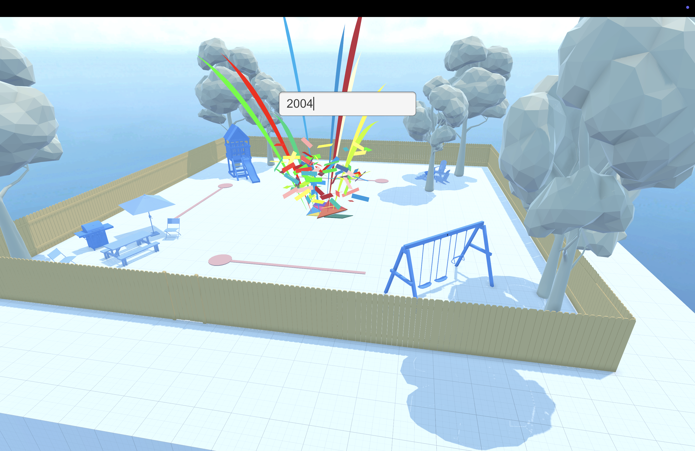
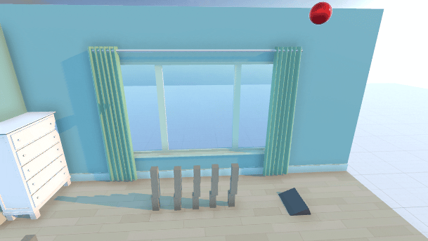
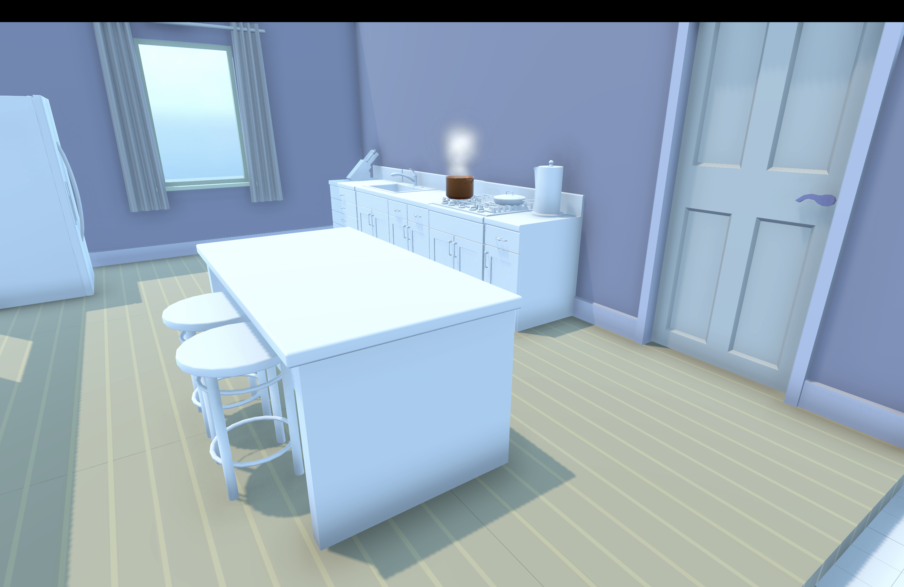
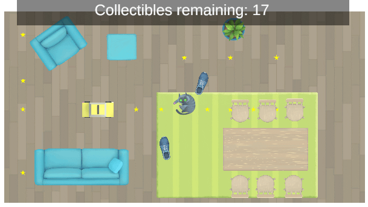

# Unity-Essentials-Pathway

## Overview

This repository contains project files for the Unity Essentials Pathway course. The course focuses on the fundamentals of Unity such as:
 - Editor interface
 - 3D Scene navigation
 - Manipulating GameObjects
 - Materials and Physics
 - Skyboxes, Lighting and Cameras
 - Audio
 - Particle Systems
 - UI and 2D Games
 - Scripting in C#
 - Publishing to Web
 - Recording work

## Scenes

# Playground Scene

Playground scene focuses on getting comfrotable with the Unity Editor interface and 3D Scene navigation, where by navigating through the scene one can find the "secret" 4 digit code. Additionally, basic GameObject manipulation is introduced.

# Kid's Room Scene

Kid's room Scene further focuses on GameObject manipulation, Materials and Physics. The scene contains a ball that falls off to the ground and subsequently rolls and knocks over blocks.

# Kitchen Scene

Kitchen Scene delves into creating more immersive soundscape by adding Audio to the scene. The scene contains a pot that emits boiling sound, fridge humming that are spatially positioned in the scene along with birds chirping outside the windows and doors.

# Living Room Scene

Introduction to C# scripting is done in the Living Room Scene. The scene contains controllable vacuum cleaner (DJ Roomba) that can be moved using WASD keys (and spacebar to jump). Puzzle pieces placed in the room are scripted to float and rotate and can be picked up by the vacuum cleaner, triggering a sound effect along with a particle system.

# 2D Game Scene

2D Game Scene introduces UI and 2D Games. The scene contains a simple 2D game where the player can move the character using WASD keys to push around the furniture in the room and collect the stars around the room. At the top of the screen, the player can see the remaining stars to collect.

Additionally, scene introduces the concept of animated sprites (laying cat)

# Bonus Scene

Bonus scene contains all the elements from the previous scenes (except for the 2D scene) and introduces the concept of publishing to Web, compiling the game into an executable file and recording the gameplay.

## Running the Application

Application can be run by downloading compiled release from the [Releases](https://github.com/nnaglis/Unity-Essentials-Pathway/releases/tag/Release) (MacOS only) or can be accessed online via the [WebGL build](https://play.unity.com/en/games/b346a1e1-0ac0-4593-b0cc-17f018ccb0db/nnaglis-unity-tutorial)